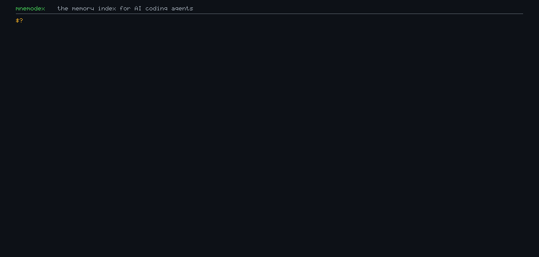



# The memory index for AI coding agents

**One binary-free command. Zero dependencies. Your whole repo, queryable in seconds.**

Badges: [](#zero-dependencies) · [](LICENSE) · [](https://www.python.org/downloads/) · [](.github/workflows/ci.yml) · [](ROADMAP.md)

---

## What is mnemodex?

AI agents forget. Every fresh session re-reads your repo, re-learns your conventions,
re-discovers the gotchas you hit last Tuesday. mnemodex is a **local memory index** that
lives inside your repository (`.mnemodex/`) and gives any agent — Claude, Codex, Cursor,
Copilot, your own script — three superpowers:

1. **Agent memory** — a persistent, searchable store of *decisions*, *gotchas*, *tips* and
   *conventions* that survives across sessions and is ranked by relevance, recency and
   importance.
2. **Codebase intelligence** — a real knowledge graph (imports, definitions, cross-file
   references) plus fuzzy full-text search for 19 languages, built with the Python
   standard library only.
3. **Context packs** — ask `mnemodex ask "cache eviction"` and get a budgeted, pre-ranked
   context bundle (memory → symbols → snippets → dependents) sized exactly for your
   model's window.

And it plugs into your tools the way you already work: a **zero-config MCP server**
(stdio or SSE), a **zero-dependency web UI**, and `export` targets that write
`CLAUDE.md` / `AGENTS.md` / Cursor rules for agents that can't talk MCP yet.

> 💡 Unlike RAG-over-READMEs, mnemodex indexes the code itself — symbols, imports and
> references — and **remembers what your team learned while building it**. That second
> part is the part that makes agents actually useful on day two.

## Install

No package manager, no `pip install`, no Node, no Docker **required** — just Python 3.9+:

```sh
# one-liner (POSIX shell)
curl -fsSL https://raw.githubusercontent.com/beijixingdeyan/mnemodex/main/install.sh | sh

# or PowerShell:
irm https://raw.githubusercontent.com/beijixingdeyan/mnemodex/main/install.ps1 | iex

# or the most boring way: clone and run
git clone https://github.com/beijixingdeyan/mnemodex
cd mnemodex && ./bin/mnemodex --help
```

> Docker users: an optional image is included (`Dockerfile`) for CI runners and
> shared boxes — but it is *never* required; the CLI runs bare anywhere Python
> exists.

Works from a git checkout with **zero** third-party dependencies — the entire tool is
one pure-Python package with no `requirements.txt`.

## Try it in 60 seconds

```sh
cd your-project
mnemodex init          # creates .mnemodex/ + a .gitignore entry (committed data only)
mnemodex index         # builds the knowledge graph + search index (~seconds)
mnemodex add "tokens expire after 60s in TokenCache; never cache the refresh token" --kind gotcha
mnemodex ask "token cache" --budget 4000   # a ranked context pack for your model
mnemodex web           # point your browser at http://127.0.0.1:8765
```

Then point your agent at the same repo:

```jsonc
// MCP client config (Claude Desktop, Cursor, ...):
{
  "mcpServers": {
    "mnemodex": { "command": "mnemodex", "args": ["serve"] }
  }
}
```

Every build your agent now starts with `mnemodex_recall`, `mnemodex_context`,
`mnemodex_lookup_symbol` — memory, symbols and context packs over a JSON-RPC 2.0 pipe.

## Why this design is deliberately anti-intuitive

1. **Zero dependencies is a feature, not an accident.** No hidden Node runtime, no
   native extension to compile, no lock-in to a language server you can't install on a
   CI box. `python3 -m mnemodex` is all there is — which means it runs *inside* the very
   CI environments your agents read about, and inside `nix-shell`-less sandboxes.
2. **The index speaks to agents, not humans.** You never read `.mnemodex/index.json`.
   It is a **protocol**: a deterministic format (version 1) that any future tool — a
   Rust reimplementation, a `grep` script, a CI diff-checker — can consume without
   trusting our code. The UI is a bonus; the contract is the point.
3. **Memory beats retries.** The cheap fix would be "re-index the repo every session".
   mnemodex instead *keeps the scars*: gotchas you record once are replayed to every
   future agent session, ranked by what you actually struggled with — the classic
   agent-failure mode of *forgetting the hard-won lesson* is engineered out.
4. **Deterministic by default.** Same repo, same commands → same index bytes.
   Reproducible builds, diffable index changes, no flaky embeddings dependency.
   (Embeddings are an *optional* future tier, never a runtime requirement.)

## Feature map

| Area | What you get |
| --- | --- |
| `mnemodex init` | Store scaffolded in `.mnemodex/`, auto-appended to `.gitignore` |
| `mnemodex index` | 19-language symbol extraction, import graph, TF-IDF + n-gram fuzzy search |
| `mnemodex add / recall / list / forget` | Kinded memories: `decision`, `gotcha`, `tip`, `api`, `convention`, `task`, `note` — ranked by relevance + recency + importance, deduped, TTL'd |
| `mnemodex ask --budget N` | Context pack: memory → symbols → snippets → dependents → largest files, all within a token budget |
| `mnemodex serve` | MCP server (stdio or SSE, JSON-RPC 2.0), 10 tools: recall, add, context, lookup_symbol, files, read_file, forget, list_memory, stats, git |
| `mnemodex web` | Zero-dependency web UI (search, memory, force-directed graph, add/forget) |
| `mnemodex graph` | Export the knowledge graph as Graphviz DOT, JSON, or shortest-path answers |
| `mnemodex export` | `CLAUDE.md`, `AGENTS.md`, Cursor rules, Markdown/JSON memory dumps |
| `mnemodex doctor / gc` | Diagnose your setup; expire/compact/dedupe the memory store |
| `mnemodex gif` | Render this README's demo GIF yourself (`mnemodex gif --out demo.gif`) — yes, the CLI ships its own GIF encoder |
| `mnemodex completion` | bash / zsh / fish / PowerShell completions |

### Built-in agent skills

mnemodex ships ready-made integration files in `skills/` so your agent picks up the
memory loop automatically:

- `skills/SKILL.md` — a portable skill definition for skill-aware agents
- `skills/cursor-rules.mdc` — Cursor rules wiring `mnemodex` into session start
- `skills/codex-agents.md` — Codex agent scaffolding
- `skills/hooks/pre-commit` — a pre-commit hook that snapshots your memory churn

## Architecture (30-second tour)

```text
                 ┌─────────────────────────── mnemodex ───────────────────────────┐
                 │                                                                 │
  repo files ──▶ │  lexer → symbols → indexer ──▶ index.json            memory.jsonl │
                 │         │                        │        ▲              ▲       │
                 │         ▼                        ▼        │              │       │
                 │  knowledge graph (imports/refs)   search   │    CLI / MCP / Web  │
                 │                              context packs ▼              │       │
                 └─────────────────────────────────────────────────────────────────┘
```

`mnemodex/graph.py` runs BFS shortest-path, k-hop neighborhoods, connected components
and PageRank on the code graph — so "what touches this symbol?" is one command, not an
hour of scrolling. All of it is plain JSON/JSONL files you can read, diff and delete.

- Architecture & data model: [`docs/ARCHITECTURE.md`](docs/ARCHITECTURE.md)
- CLI reference: [`docs/CLI.md`](docs/CLI.md)
- MCP protocol & tools: [`docs/MCP.md`](docs/MCP.md)
- Design rationale, differentiation & roadmap: [`docs/STRATEGY.md`](docs/STRATEGY.md)
- Demo GIF rendering internals: [`docs/GIF_SPEC.md`](docs/GIF_SPEC.md)

## Roadmap (highlights)

- [ ] 0.2 — memory TTL tiers, cross-repo sticky memory, auto-gotcha extraction from git diffs
- [ ] 0.3 — large-monorepo mode (mmap tokenizer, incremental indexing), language-server surface
- [ ] 1.0 — native binary (via Rust), plugin memory backends (SQLite/Redis), team memory sync
- Full plan: [`ROADMAP.md`](ROADMAP.md)

## Contributing

Yes please — see [`CONTRIBUTING.md`](CONTRIBUTING.md). The unfixable rule:
**stdlib only.** Any third-party dependency needs a written RFC and a really good
reason. Tests are plain `unittest`:

```sh
python -m unittest discover -s tests
```

## License & thanks

[MIT](LICENSE). Built as a gift to every agent that has to re-learn a codebase from
scratch, every single day.